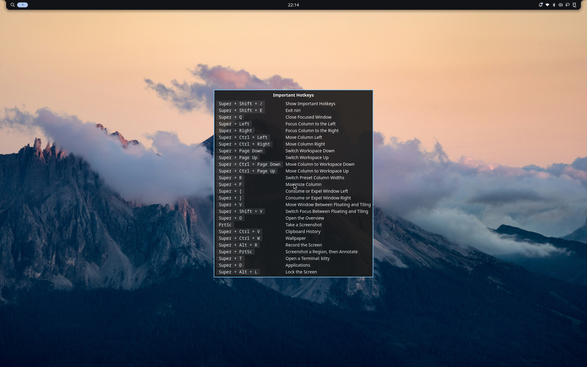

# Kuma

[](https://github.com/Letdown2491/kuma-linux/actions/workflows/ci.yml)

**Your system is one file.**

Kuma turns a short text file into a working Linux system. You write down what
the machine should have, a desktop and some applications and a few command
line tools, and kuma builds that description into a complete system image.
Installing a machine, and every update after it, comes from that file.

Building the whole system rather than editing a running one buys three
things. An update lands completely or not at all. The version you were
running is still on the disk, so going back is a reboot. And a new system
that cannot boot to a working desktop puts the old one back by itself,
without you there.

Kuma is a layer over [Fedora bootc](https://docs.fedoraproject.org/en-US/bootc/).
Fedora supplies the packages and the kernel; kuma decides what goes into the
image and keeps the running machine matching your file. New to any of these
words? [The glossary](docs/glossary.md) defines each in a line.



## Your declaration

```toml
schema_version = 1

[system]
desktop = "niri"   # "niri", or "cosmic" (experimental); omit for headless

[user]
name = "me"
shell = "fish"
# password_hash = '$6$...'   # from `kuma passwd`; applies only at creation

[packages]
rpm = ["fish", "distrobox", "tailscale"]
flatpak = ["org.mozilla.firefox"]   # applications, installed while it runs
brew = ["ripgrep", "gh"]            # command line tools, no reboot needed

[services]
enable = ["tailscaled.service"]

[snapshots]
enable = true   # hourly read-only btrfs snapshots of /var/home

[overrides."org.mozilla.firefox"]
sockets = ["wayland", "!x11"]   # what an app may touch; "!" takes it away

[backup]
enable = true
repo = "s3:https://minio.example:9000/kuma"   # offsite, as restic spells it
secret = "backup"   # names the credential; the value lives on the machine
```

Three package lists, because the three behave differently. `rpm` is part of
the image, so changing it builds a new one and takes effect at the next
boot. `flatpak` and `brew` are installed on the running machine and land
immediately.

A commented version of the same file lives in
[`examples/`](examples/niri.toml), and a test keeps every example valid
against the current schema.

**You do not have to name a base image.** With `system.base` unset, kuma
composes its own foundation from Fedora's package repositories: bootc,
systemd, the kernel, dnf, and the hardware support a real machine needs.
Fedora stays the package source, and kuma builds no packages and no kernels.
Name a base and kuma builds on that image instead, as any bootc image can.

**Your machine's own settings stay out of the file.** Hostname, timezone,
and whether a disk is encrypted belong to the machine rather than to the
description, and they survive image updates. Two machines built from one
file can differ on all three. Pin them here only if you want every machine
built from this file to match.

`[system].firmware` trims what the base carries. Unset, it ships every
vendor's, so a machine that declares nothing about its own hardware still
boots with working graphics, wifi, and audio.

## Status

Kuma is early. It builds, boots, and updates real hardware, and it has not
been run widely. Schema version 1 is meant to be permanent, so the fields
above are promises; everything around them can still move, and
[`CHANGELOG.md`](CHANGELOG.md) is where it says what moved. `bootc` will roll
a bad image back, but try a declaration in `kuma vm` before a machine you
depend on.

## Getting a machine

Two downloads, depending on what you have. Installer media, which becomes a
machine:

```console
$ curl -LO https://github.com/Letdown2491/kuma-linux/releases/latest/download/kuma-x86_64.iso
```

Or the binary, for building images on a machine you already have. One
self-contained file: the wallpaper, the greeter configuration and every
desktop asset are compiled in, so it needs nothing installed beside it.

```console
$ curl -LO https://github.com/Letdown2491/kuma-linux/releases/latest/download/kuma-x86_64-unknown-linux-musl
$ chmod +x kuma-x86_64-unknown-linux-musl
$ sudo mv kuma-x86_64-unknown-linux-musl /usr/local/bin/kuma
```

A machine already running a kuma image has kuma at `/usr/bin/kuma`, baked in
by the build that made it, and a copy in `/usr/local/bin` would shadow it.

Both are signed. [`SECURITY.md`](SECURITY.md) carries the `cosign verify-blob`
command, what a declaration trusts, and where to report a vulnerability.

**[Getting started →](docs/getting-started.md)** walks the whole path once,
from media to a machine you declared. It assumes nothing is installed.

## Everyday use

The loop is three commands. Edit the file, then:

```console
$ kuma check
$ kuma build
$ kuma switch
```

`check` says whether the file is valid, `build` turns it into an image, and
`switch` makes that image what boots next time. Nothing about the running
system changes until you reboot, and the deployment you were on is still on
the disk.

Those are the ones you type. The rest of the surface:

| | |
|---|---|
| `kuma check` | is the file valid |
| `kuma build` | turn it into an image |
| `kuma switch` | boot that image next time |
| `kuma update` | pull a newer base and rebuild |
| `kuma rollback` | go back to the previous deployment |
| `kuma sync` | converge the running machine now |
| `kuma diff` | what the machine has that the file does not |
| `kuma capture` | turn that drift into a proposal against the file |
| `kuma add` / `kuma remove` | edit a package list without opening an editor |
| `kuma doctor` | grade every promise the machine relies on |
| `kuma snapshot` | reach the local snapshots |
| `kuma backup` | reach the offsite copies |
| `kuma hibernate` | make a swapfile, the kernel arguments to resume from it, and a lid that hibernates before the battery dies |
| `kuma clean` | reclaim what old builds left |
| `kuma completions` | shell completions, e.g. `kuma completions fish \| source` |

Every command ends by naming the legal next ones, so the surface is
discoverable without this table. `kuma --help` lists all of it.

## How this differs

**NixOS and Guix** own the idea: one versioned file, convergence as the only
way to change anything, rollback for free. Getting there cost them an entire
package universe. Kuma keeps Fedora as the package source and builds no
packages and no kernels, so the declarative property arrives without an
ecosystem to rebuild. Nix's purity guarantees are what you give up for that.

**Universal Blue** (Bluefin, Bazzite) ships the same three layers: immutable
base, flatpaks for applications, Homebrew for command line tools. The unit of
configuration is which image you chose. Brewfiles now declare flatpaks and
formulae together, but `brew bundle` is a command you run rather than a loop
that runs without you, and its cleanup decides what to remove from what is
installed rather than from what it installed. Kuma converges at boot and on a
daily timer, and records what it installed, so an application you added
yourself stays yours and `kuma capture` offers to write it down. Already
running one of those images? [Moving over](docs/moving.md) is the short
path.

**BlueBuild** builds an image from a recipe and stops at the image. The
recipe never reaches the running machine. Kuma's keeps working after install:
`sync` converges, `diff` reports drift across file, image, and machine,
`kuma.lock` records what the last build resolved to, and `capture` turns a
change you made by hand into a proposal against the declaration instead of an
error to erase.

## Principles

In order:

1. **Simple.** The schema stays small and boring. Every field is a promise
   kept forever, so new ones have to earn their place.
2. **Atomic.** Applying a declaration never mutates the running system: it
   builds an image and switches to it on next boot. Rollback is always
   available, and automatic when an update can't boot to a healthy system.
3. **Local-first.** `kuma build` needs nothing but podman. No forge account,
   no CI, no registry. All optional, later.
4. **Self-describing.** Every command reports where you are and ends at the
   legal next commands, never a dead end. The image carries the declaration
   it was built from, so a machine can always speak for itself.

## Documentation

- [Getting started](docs/getting-started.md): the whole path once, from
  downloading the media to living with a machine you declared.
- [Moving over](docs/moving.md): rebase a machine that boots an image,
  or back up and install one that doesn't.
- [How kuma behaves](docs/concepts.md): why drift is a proposal rather than
  an error, what `kuma.lock` pins and what it only records, how `/etc` is
  merged rather than replaced, how a bad update rolls itself back, and what
  an install decides that a declaration cannot.
- [What a desktop contains](docs/desktops.md): what `desktop = "niri"` or
  `"cosmic"` installs that you didn't name, why the surprising parts are
  there, and what you can change.
- [Glossary](docs/glossary.md): every term these docs use, one line each.
- [For agents](docs/agents.md): the JSON surface, and why every response ends
  at the legal next commands.
- [Contributing](CONTRIBUTING.md): smoke tests, the development container,
  what CI checks, and how a release is cut.

## Not yet

- **No custom partition layout.** `kuma install` writes the same three
  partitions on every disk. Anything else, including installing beside
  another system, still has to be done by something else.
- **No proprietary NVIDIA driver.** Images carry `nvidia-gpu-firmware` and
  nouveau, which is what an NVIDIA machine boots on. Kuma enables RPM Fusion
  free, not nonfree, and builds no kernel modules, so declaring
  `akmod-nvidia` fails the build rather than working.
