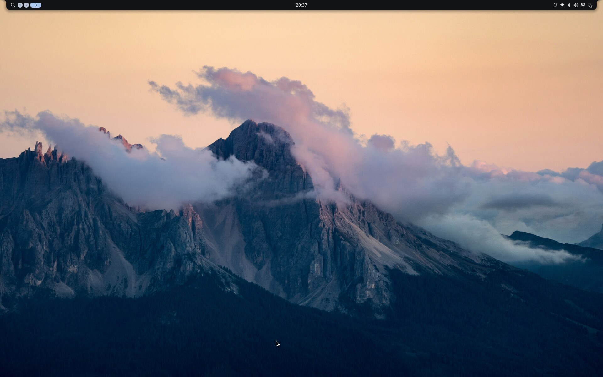

# Kuma

[](https://github.com/Letdown2491/kuma-linux/actions/workflows/ci.yml)

**Your system is one file.**

Kuma turns a short text file into a working Linux system. You write down what
the machine should have, a desktop and some applications and a few command
line tools, and kuma builds that description into a complete system image.
Installing a machine, and every update after it, comes from that file.

Building the whole system rather than editing a running one buys three
things. An update lands completely or not at all. The version you were
running is still on the disk, so going back is a reboot. And a new system
that cannot boot to a working desktop puts the old one back by itself,
without you there.

Kuma is a layer over [Fedora bootc](https://docs.fedoraproject.org/en-US/bootc/).
Fedora supplies the packages and the kernel; kuma decides what goes into the
image and keeps the running machine matching your file. New to any of these
words? [The glossary](docs/glossary.md) defines each in a line.



## Your declaration

```toml
schema_version = 1

[system]
desktop = "niri"   # "niri", or "cosmic" (experimental); omit for headless

[user]
name = "me"
shell = "fish"
# password_hash = '$6$...'   # from `kuma passwd`; applies only at creation

[packages]
rpm = ["fish", "distrobox", "tailscale"]
flatpak = ["org.mozilla.firefox"]   # applications, installed while it runs
brew = ["ripgrep", "gh"]            # command line tools, no reboot needed

[services]
enable = ["tailscaled.service"]

[snapshots]
enable = true   # hourly read-only btrfs snapshots of /var/home

[overrides."org.mozilla.firefox"]
sockets = ["wayland", "!x11"]   # what an app may touch; "!" takes it away

[backup]
enable = true
repo = "s3:https://minio.example:9000/kuma"   # offsite, as restic spells it
secret = "backup"   # names the credential; the value lives on the machine
```

Three package lists, because the three behave differently. `rpm` is part of
the image, so changing it builds a new one and takes effect at the next
boot. `flatpak` and `brew` are installed on the running machine and land
immediately.

A commented version of the same file lives in
[`examples/`](examples/niri.toml), and a test keeps every example valid
against the current schema.

**You do not have to name a base image.** With `system.base` unset, kuma
composes its own foundation from Fedora's package repositories: bootc,
systemd, the kernel, dnf, and the hardware support a real machine needs.
Fedora stays the package source, and kuma builds no packages and no kernels.
Name a base and kuma builds on that image instead, as any bootc image can.

**Your machine's own settings stay out of the file.** Hostname, timezone,
and whether a disk is encrypted belong to the machine rather than to the
description, and they survive image updates. Two machines built from one
file can differ on all three. Pin them here only if you want every machine
built from this file to match.

`[system].firmware` trims what the base carries. Unset, it ships every
vendor's, so a machine that declares nothing about its own hardware still
boots with working graphics, wifi, and audio.

## Status

Kuma is early. It builds, boots, and updates real hardware, and it has not
been run widely. Schema version 1 is meant to be permanent, so the fields
above are promises; everything around them can still move, and
[`CHANGELOG.md`](CHANGELOG.md) is where it says what moved. `bootc` will roll
a bad image back, but try a declaration in `kuma vm` before a machine you
depend on.

## Install kuma

Kuma is one self-contained file. The wallpaper, the greeter configuration,
and every desktop asset are compiled into it, and the published build needs
nothing installed alongside it. That matters on the machines most likely to
want kuma, which tend to have podman and no compiler.

```console
$ curl -LO https://github.com/Letdown2491/kuma-linux/releases/latest/download/kuma-x86_64-unknown-linux-musl
$ chmod +x kuma-x86_64-unknown-linux-musl
$ sudo mv kuma-x86_64-unknown-linux-musl /usr/local/bin/kuma
```

This is for the machine you build from. A machine already running a kuma
image has kuma at `/usr/bin/kuma`, baked in by the build that made the image,
and a copy in `/usr/local/bin` would shadow it.

Every release is signed, and each one carries the `cosign verify-blob`
command that checks it came from this repository's release workflow.
[`SECURITY.md`](SECURITY.md) has that command, what a declaration trusts, and
where to report a vulnerability.

Building `main` yourself needs a Rust toolchain at 1.85 or newer and a
linker. Keep `--locked`: without it cargo ignores the committed `Cargo.lock`
and resolves fresh, so you get versions nobody tested.

```console
$ cargo install --git https://github.com/Letdown2491/kuma-linux --locked
```

Cloning instead of installing also gets you the example declarations and the
smoke tests:

```console
$ git clone https://github.com/Letdown2491/kuma-linux
$ cd kuma-linux && cargo install --path .
```

## Quick start

```console
$ kuma init          # starter kuma.toml (on a kuma machine: its own declaration)
$ vim kuma.toml      # declare your packages and services
$ kuma build         # podman-builds localhost/kuma:latest
$ kuma vm            # boot it in a throwaway VM before anything real
$ kuma switch --yes  # on a bootc machine: take it at the next boot
```

Without `--yes`, `switch` only prints what it would do.

[Getting started](docs/getting-started.md) walks the whole path instead:
installing a machine from the published media, what the first boot does, then
describing and building an image of your own, and how updates work once it is
yours.

**What needs what.** `init`, `check`, `generate`, and `build` need only
podman. `switch`, `update`, `rollback`, and `doctor` need to be running on a
bootc machine, and a kuma one already has kuma. `vm` and `iso` need KVM and
sudo, except `iso --live`, which needs neither. `install` needs sudo and a
disk you are willing to lose: it is the one command here that cannot be
undone.

## Everyday use

The file stays the interface. These read it or edit it for you:

```console
$ kuma                                     # where this machine is, and its next moves
$ kuma menu                                # the desktop menu: apps, settings, system, power
$ kuma add --flatpak org.mozilla.firefox   # declare (--rpm / --brew too)
$ kuma remove org.mozilla.firefox          # drop from whichever list declares it
$ kuma capture                             # declare what this machine already runs
$ kuma check                               # validate the declaration, build nothing
$ kuma diff                                # drift: kuma.toml vs image vs machine
$ kuma doctor                              # machine health: image age, convergence, /etc drift, encryption, snapshots, GPU
$ kuma sync                                # converge, and update everything installed
$ kuma snapshot                            # the btrfs snapshots this machine has taken
$ kuma snapshot --restore ~/notes.md       # bring a path back (dry run; --yes writes)
$ kuma update --check                      # what has moved in the repos, security first
$ kuma update --yes                        # rebuild on the latest packages, stage it
$ kuma rollback --yes                      # boot order back to the previous deployment
$ kuma clean                               # reclaim dangling images, stale bases, build leftovers
```

Running bare `kuma` is always safe, and every command ends by naming what you
can legally do next, so you can follow the output rather than memorize the
verbs.

`add`, `remove`, and `capture` preserve your comments and formatting.
`check`, `diff`, `doctor`, and `update --check` change nothing. Everything
speaks `--json`.

On a niri desktop `kuma menu` is bound to `Mod+D`, and it is the launcher:
your applications, the settings kuma does not own (network, bluetooth, audio),
the ones it does (the declaration, health, updates, rollback), and the power
actions. It never writes the declaration. `kuma menu --list` prints the rows
instead of drawing them, which is how to read it over ssh.

Three more exist for when you need them and never otherwise: `kuma passwd`
hashes a password for `[user]`, `kuma schema` prints the JSON Schema for
`kuma.toml`, and `kuma completions fish | source` wires up your shell.

## Putting it on a machine

Every release carries installer media, so a machine can be installed without
building anything first:

```console
$ curl -LO https://github.com/Letdown2491/kuma-linux/releases/latest/download/kuma-x86_64.iso
```

That media installs `ghcr.io/letdown2491/kuma:niri`. The verbs below are for
putting a declaration of your own onto hardware:

```console
$ kuma vm                 # boot the image in a disposable QEMU VM
$ kuma iso --live         # bootable media: the image is its own live session
$ kuma install            # write an image to a disk (destructive)
```

`iso --live` builds media that boots to a working desktop before anything is
written to a disk, because the ISO's root filesystem *is* the image rather
than an installer beside it. `kuma iso` without `--live` builds Anaconda
media instead, which is about a gigabyte larger for the same system.

`install` pulls the image rather than copying the media, so it installs the
image the media was built from when that came from a registry, and
`ghcr.io/letdown2491/kuma:niri` when it did not. Media built from a local
`kuma build` is the second case, and says so before it installs anything.
`--image` names another.

It asks which disk, then whether to encrypt it, then for an account and a
hostname, because a shared image cannot declare either: the image is shared
and you are not. It writes those answers down, and the machine creates them
on its first boot.

It partitions the disk itself, so the plan it prints is the layout it will
write. It is the one verb here that cannot be undone, so it dry-runs by
default and refuses a disk with anything mounted on it.

## How this differs

**NixOS and Guix** own the idea: one versioned file, convergence as the only
way to change anything, rollback for free. Getting there cost them an entire
package universe. Kuma keeps Fedora as the package source and builds no
packages and no kernels, so the declarative property arrives without an
ecosystem to rebuild. Nix's purity guarantees are what you give up for that.

**Universal Blue** (Bluefin, Bazzite) ships the same three layers: immutable
base, flatpaks for applications, Homebrew for command line tools. The unit of
configuration is which image you chose. Brewfiles now declare flatpaks and
formulae together, but `brew bundle` is a command you run rather than a loop
that runs without you, and its cleanup decides what to remove from what is
installed rather than from what it installed. Kuma converges at boot and on a
daily timer, and records what it installed, so an application you added
yourself stays yours and `kuma capture` offers to write it down.

**BlueBuild** builds an image from a recipe and stops at the image. The
recipe never reaches the running machine. Kuma's keeps working after install:
`sync` converges, `diff` reports drift across file, image, and machine,
`kuma.lock` records what the last build resolved to, and `capture` turns a
change you made by hand into a proposal against the declaration instead of an
error to erase.

## Principles

In order:

1. **Simple.** The schema stays small and boring. Every field is a promise
   kept forever, so new ones have to earn their place.
2. **Atomic.** Applying a declaration never mutates the running system: it
   builds an image and switches to it on next boot. Rollback is always
   available, and automatic when an update can't boot to a healthy system.
3. **Local-first.** `kuma build` needs nothing but podman. No forge account,
   no CI, no registry. All optional, later.
4. **Self-describing.** Every command reports where you are and ends at the
   legal next commands, never a dead end. The image carries the declaration
   it was built from, so a machine can always speak for itself.

## Documentation

- [Getting started](docs/getting-started.md): the whole path once, from
  downloading the media to living with a machine you declared.
- [How kuma behaves](docs/concepts.md): why drift is a proposal rather than
  an error, what `kuma.lock` pins and what it only records, how `/etc` is
  merged rather than replaced, how a bad update rolls itself back, and what
  an install decides that a declaration cannot.
- [What a desktop contains](docs/desktops.md): what `desktop = "niri"` or
  `"cosmic"` installs that you didn't name, why the surprising parts are
  there, and what you can change.
- [Glossary](docs/glossary.md): every term these docs use, one line each.
- [For agents](docs/agents.md): the JSON surface, and why every response ends
  at the legal next commands.
- [Contributing](CONTRIBUTING.md): smoke tests, the development container,
  what CI checks, and how a release is cut.

## Not yet

- **No custom partition layout.** `kuma install` writes the same three
  partitions on every disk. Anything else, including installing beside
  another system, still has to be done by something else.
- **No hibernate.** A swapfile's size and `resume_offset` are properties
  of the installed disk, so it needs a first-boot unit rather than an
  image that already knows the answer.
- **Only booted on AMD graphics.** Images carry Intel and NVIDIA firmware,
  the i915, xe and nouveau drivers, and Intel's Mesa and Vulkan drivers, and
  CI boots every build on a virtio GPU. None of that is a report from
  somebody whose laptop has Intel graphics in it, because nobody has run one
  yet.
